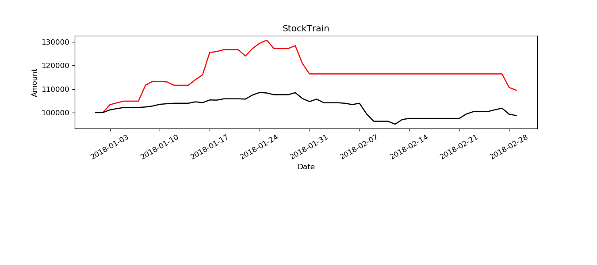
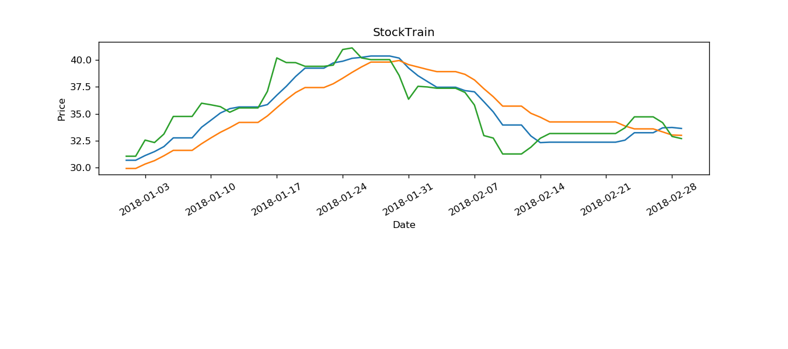

# Infomation : 
additional info : None
version : 0.1
option(num : 2) : 
	use_real_price : True
	order_volume_ratio : 1
benchmark : hs300
OrderCost : 
	open_tax : 0
	close_tax : 0.001
	open_commission : 0.0003
	close_commission : 0.003
	close_today_commission : 0
	min_commission : 5
type : stock
{'2018-01-01': 100000.0, '2018-01-02': 100000.0, '2018-01-03': 103338.63275039745, '2018-01-04': 104165.34181240063, '2018-01-05': 104864.86486486485, '2018-01-06': 104864.86486486485, '2018-01-07': 104864.86486486485, '2018-01-08': 111637.51987281398, '2018-01-09': 113290.93799682036, '2018-01-10': 113195.54848966614, '2018-01-11': 113036.56597774243, '2018-01-12': 111605.72337042926, '2018-01-13': 111605.72337042926, '2018-01-14': 111605.72337042926, '2018-01-15': 113958.66454689985, '2018-01-16': 116057.23370429252, '2018-01-17': 125532.59141494434, '2018-01-18': 125914.14944356121, '2018-01-19': 126709.06200317966, '2018-01-20': 126709.06200317966, '2018-01-21': 126709.06200317966, '2018-01-22': 124006.35930047695, '2018-01-23': 127186.00953895072, '2018-01-24': 129411.76470588236, '2018-01-25': 130747.21780604133, '2018-01-26': 127186.00953895072, '2018-01-27': 127186.00953895072, '2018-01-28': 127186.00953895072, '2018-01-29': 128394.27662957076, '2018-01-30': 120826.70906200318, '2018-01-31': 116406.99523052464, '2018-02-01': 116406.99523052464, '2018-02-02': 116406.99523052464, '2018-02-03': 116406.99523052464, '2018-02-04': 116406.99523052464, '2018-02-05': 116406.99523052464, '2018-02-06': 116406.99523052464, '2018-02-07': 116406.99523052464, '2018-02-08': 116406.99523052464, '2018-02-09': 116406.99523052464, '2018-02-10': 116406.99523052464, '2018-02-11': 116406.99523052464, '2018-02-12': 116406.99523052464, '2018-02-13': 116406.99523052464, '2018-02-14': 116406.99523052464, '2018-02-15': 116406.99523052464, '2018-02-16': 116406.99523052464, '2018-02-17': 116406.99523052464, '2018-02-18': 116406.99523052464, '2018-02-19': 116406.99523052464, '2018-02-20': 116406.99523052464, '2018-02-21': 116406.99523052464, '2018-02-22': 116406.99523052464, '2018-02-23': 116406.99523052464, '2018-02-24': 116406.99523052464, '2018-02-25': 116406.99523052464, '2018-02-26': 116406.99523052464, '2018-02-27': 116406.99523052464, '2018-02-28': 110654.71973521507, '2018-03-01': 109497.45720953151}
{'2018-01-01': 100000, '2018-01-02': 100000.0, '2018-01-03': 101143.3275404738, '2018-01-04': 101703.49623381728, '2018-01-05': 102178.62607874499, '2018-01-06': 102178.62607874499, '2018-01-07': 102178.62607874499, '2018-01-08': 102364.27775072247, '2018-01-09': 102776.86448911182, '2018-01-10': 103510.07735074322, '2018-01-11': 103755.05845184797, '2018-01-12': 103953.56483346972, '2018-01-13': 103953.56483346972, '2018-01-14': 103953.56483346972, '2018-01-15': 104564.16354157138, '2018-01-16': 104212.63667399221, '2018-01-17': 105353.73936087372, '2018-01-18': 105294.40993174643, '2018-01-19': 105852.10656554294, '2018-01-20': 105852.10656554294, '2018-01-21': 105852.10656554294, '2018-01-22': 105717.13211427836, '2018-01-23': 107457.70924130022, '2018-01-24': 108509.81778449079, '2018-01-25': 108325.1549363321, '2018-01-26': 107589.47001515373, '2018-01-27': 107589.47001515373, '2018-01-28': 107589.47001515373, '2018-01-29': 108450.73556131822, '2018-01-30': 105969.28218806935, '2018-01-31': 104669.72048422701, '2018-02-01': 105713.67123091262, '2018-02-02': 104171.10607360309, '2018-02-03': 104171.10607360309, '2018-02-04': 104171.10607360309, '2018-02-05': 103936.75482855031, '2018-02-06': 103389.68805080577, '2018-02-07': 103968.39719075154, '2018-02-08': 99447.98910316151, '2018-02-09': 96315.64245119537, '2018-02-10': 96315.64245119537, '2018-02-11': 96315.64245119537, '2018-02-12': 95082.08473725714, '2018-02-13': 97043.16957586874, '2018-02-14': 97524.97398157326, '2018-02-15': 97524.97398157326, '2018-02-16': 97524.97398157326, '2018-02-17': 97524.97398157326, '2018-02-18': 97524.97398157326, '2018-02-19': 97524.97398157326, '2018-02-20': 97524.97398157326, '2018-02-21': 97524.97398157326, '2018-02-22': 99400.77276581438, '2018-02-23': 100408.8786490689, '2018-02-24': 100408.8786490689, '2018-02-25': 100408.8786490689, '2018-02-26': 101191.28549568502, '2018-02-27': 101870.36025323778, '2018-02-28': 99297.44067675102, '2018-03-01': 98755.56522405511}
record : 
	key : ma_n1
		{'2018-01-01': 30.683999999999997, '2018-01-02': 30.683999999999997, '2018-01-03': 31.122000000000003, '2018-01-04': 31.488, '2018-01-05': 31.953999999999997, '2018-01-06': 32.766, '2018-01-07': 32.766, '2018-01-08': 32.766, '2018-01-09': 33.751999999999995, '2018-01-10': 34.408, '2018-01-11': 35.076, '2018-01-12': 35.482, '2018-01-13': 35.64, '2018-01-14': 35.64, '2018-01-15': 35.64, '2018-01-16': 35.86, '2018-01-17': 36.73199999999999, '2018-01-18': 37.55200000000001, '2018-01-19': 38.474000000000004, '2018-01-20': 39.248000000000005, '2018-01-21': 39.248000000000005, '2018-01-22': 39.248000000000005, '2018-01-23': 39.736, '2018-01-24': 39.892, '2018-01-25': 40.164, '2018-01-26': 40.251999999999995, '2018-01-27': 40.37599999999999, '2018-01-28': 40.37599999999999, '2018-01-29': 40.37599999999999, '2018-01-30': 40.184, '2018-01-31': 39.260000000000005, '2018-02-01': 38.54600000000001, '2018-02-02': 38.006, '2018-02-03': 37.474000000000004, '2018-02-04': 37.474000000000004, '2018-02-05': 37.474000000000004, '2018-02-06': 37.158, '2018-02-07': 37.05, '2018-02-08': 36.134, '2018-02-09': 35.184, '2018-02-10': 33.962, '2018-02-11': 33.962, '2018-02-12': 33.962, '2018-02-13': 32.944, '2018-02-14': 32.32599999999999, '2018-02-15': 32.364, '2018-02-16': 32.364, '2018-02-17': 32.364, '2018-02-18': 32.364, '2018-02-19': 32.364, '2018-02-20': 32.364, '2018-02-21': 32.364, '2018-02-22': 32.364, '2018-02-23': 32.553999999999995, '2018-02-24': 33.244, '2018-02-25': 33.244, '2018-02-26': 33.244, '2018-02-27': 33.7, '2018-02-28': 33.734, '2018-03-01': 33.64}
	key : ma_n2
		{'2018-01-01': 29.921, '2018-01-02': 29.921, '2018-01-03': 30.331, '2018-01-04': 30.647999999999996, '2018-01-05': 31.1, '2018-01-06': 31.603999999999996, '2018-01-07': 31.603999999999996, '2018-01-08': 31.603999999999996, '2018-01-09': 32.218, '2018-01-10': 32.765, '2018-01-11': 33.282, '2018-01-12': 33.718, '2018-01-13': 34.202999999999996, '2018-01-14': 34.202999999999996, '2018-01-15': 34.202999999999996, '2018-01-16': 34.806, '2018-01-17': 35.57, '2018-01-18': 36.31399999999999, '2018-01-19': 36.977999999999994, '2018-01-20': 37.444, '2018-01-21': 37.444, '2018-01-22': 37.444, '2018-01-23': 37.798, '2018-01-24': 38.312, '2018-01-25': 38.858000000000004, '2018-01-26': 39.363, '2018-01-27': 39.812, '2018-01-28': 39.812, '2018-01-29': 39.812, '2018-01-30': 39.96, '2018-01-31': 39.57600000000001, '2018-02-01': 39.355000000000004, '2018-02-02': 39.129000000000005, '2018-02-03': 38.925, '2018-02-04': 38.925, '2018-02-05': 38.925, '2018-02-06': 38.67100000000001, '2018-02-07': 38.155, '2018-02-08': 37.34, '2018-02-09': 36.595000000000006, '2018-02-10': 35.718, '2018-02-11': 35.718, '2018-02-12': 35.718, '2018-02-13': 35.051, '2018-02-14': 34.688, '2018-02-15': 34.249, '2018-02-16': 34.249, '2018-02-17': 34.249, '2018-02-18': 34.249, '2018-02-19': 34.249, '2018-02-20': 34.249, '2018-02-21': 34.249, '2018-02-22': 34.249, '2018-02-23': 33.869, '2018-02-24': 33.602999999999994, '2018-02-25': 33.602999999999994, '2018-02-26': 33.602999999999994, '2018-02-27': 33.321999999999996, '2018-02-28': 33.029999999999994, '2018-03-01': 33.001999999999995}
	key : close
		{'2018-01-01': 31.06, '2018-01-02': 31.06, '2018-01-03': 32.56, '2018-01-04': 32.33, '2018-01-05': 33.12, '2018-01-06': 34.76, '2018-01-07': 34.76, '2018-01-08': 34.76, '2018-01-09': 35.99, '2018-01-10': 35.84, '2018-01-11': 35.67, '2018-01-12': 35.15, '2018-01-13': 35.55, '2018-01-14': 35.55, '2018-01-15': 35.55, '2018-01-16': 37.09, '2018-01-17': 40.2, '2018-01-18': 39.77, '2018-01-19': 39.76, '2018-01-20': 39.42, '2018-01-21': 39.42, '2018-01-22': 39.42, '2018-01-23': 39.53, '2018-01-24': 40.98, '2018-01-25': 41.13, '2018-01-26': 40.2, '2018-01-27': 40.04, '2018-01-28': 40.04, '2018-01-29': 40.04, '2018-01-30': 38.57, '2018-01-31': 36.36, '2018-02-01': 37.56, '2018-02-02': 37.5, '2018-02-03': 37.38, '2018-02-04': 37.38, '2018-02-05': 37.38, '2018-02-06': 36.99, '2018-02-07': 35.82, '2018-02-08': 32.98, '2018-02-09': 32.75, '2018-02-10': 31.27, '2018-02-11': 31.27, '2018-02-12': 31.27, '2018-02-13': 31.9, '2018-02-14': 32.73, '2018-02-15': 33.17, '2018-02-16': 33.17, '2018-02-17': 33.17, '2018-02-18': 33.17, '2018-02-19': 33.17, '2018-02-20': 33.17, '2018-02-21': 33.17, '2018-02-22': 33.17, '2018-02-23': 33.7, '2018-02-24': 34.72, '2018-02-25': 34.72, '2018-02-26': 34.72, '2018-02-27': 34.18, '2018-02-28': 32.9, '2018-03-01': 32.7}

### main plot : 

 

### record plot : 

 

